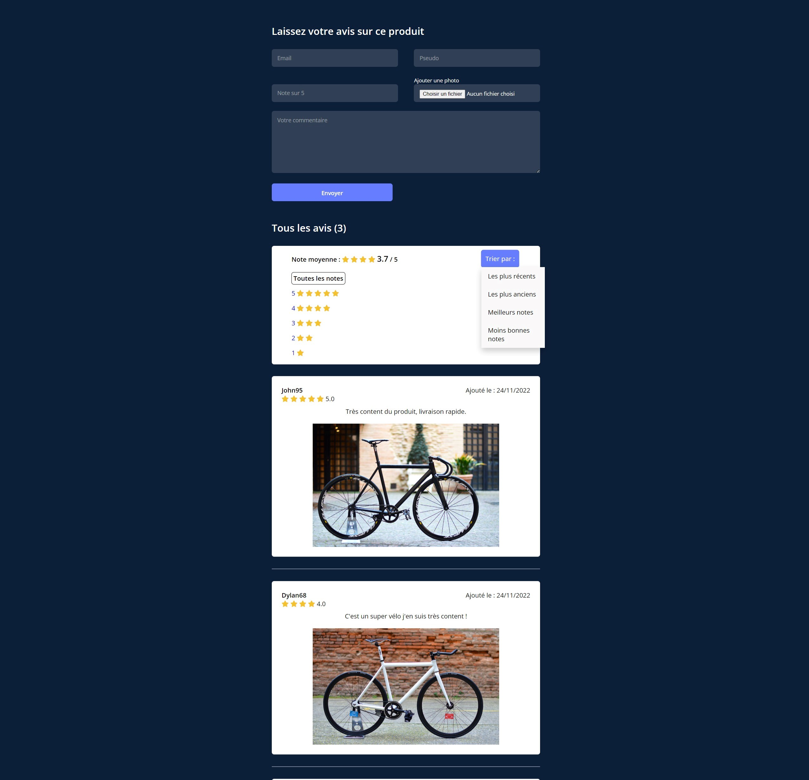

# Review product system

## Welcome! 👋

Thanks for checking out this personal project.

## The Project

It's a review system that you can use for a product page, it has been made with Laravel and a MySQL database managed with phpMyAdmin.

The functionalities are :
- The possibility to let a review with a mail adress, nickname, rate, pic of the product and a comment
- We can filter by rate, so by clicking on a certain rate number from 5 to 1 we can filter what the page show us
- There is the rate average of the product
- There is a sorting system, by the most recent or by the oldest review and by best rates or by the worst ones

Stacks used :
- PHP
- Blade
- CSS
- HTML
- JavaScript

Framework :
- Laravel 9
 
**Don't hesitate to contact me for further informations or to check the code to see more about this app!** 🚀
